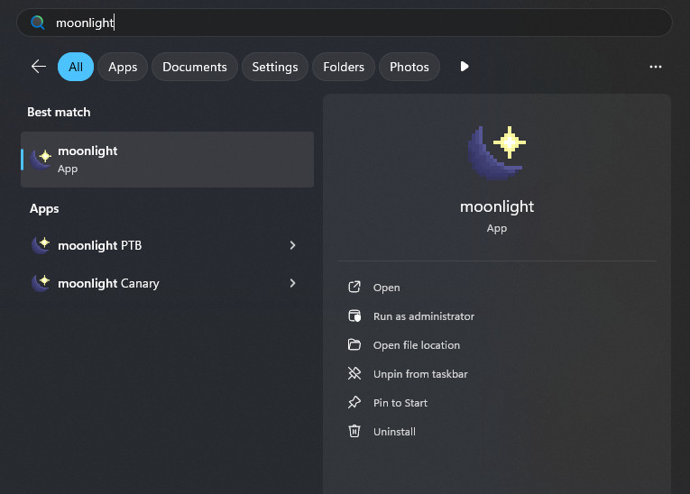
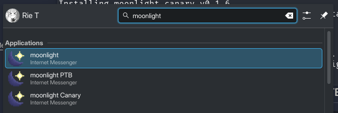

# 🌙 moonlight launcher

[](https://github.com/MeguminSama/moonlight-launcher/releases/latest)
[](LICENSE)
[](CONTRIBUTING.md)

The cross-platform launcher for moonlight that doesn't modify your Discord install.

## ✨ Features

- **Automatic Updates**: Always run the latest version of moonlight with zero effort
- **Cross-Platform**: Works on Windows, Linux (including Flatpak)
- **Multiple Discord Branches**: Releases available for Discord Stable, PTB, and Canary
- **Developer Friendly**: Support for local git installations of moonlight

## 📦 Installation

### Windows

1. Download the latest installer from [Releases](https://github.com/MeguminSama/moonlight-launcher/releases/latest/download/moonlight-installer.exe)
2. Run the installer and follow the on-screen instructions
3. Select your preferred Discord branches during installation

### Linux

#### Stable Release
```bash
sh -c "$(curl -fsSL https://github.com/MeguminSama/moonlight-launcher/releases/latest/download/install.sh)"
```

#### PTB (Public Test Build)
```bash
sh -c "$(curl -fsSL https://github.com/MeguminSama/moonlight-launcher/releases/latest/download/install.sh)" -- ptb
```

#### Canary (Development Build)
```bash
sh -c "$(curl -fsSL https://github.com/MeguminSama/moonlight-launcher/releases/latest/download/install.sh)" -- canary
```

#### AUR (Arch Linux)
```bash
yay -S moonlight-stable  # or moonlight-ptb or moonlight-canary
```

### Uninstalling
```bash
sh -c "$(curl -fsSL https://github.com/MeguminSama/moonlight-launcher/releases/latest/download/install.sh)" -- --uninstall <branch>
```

## 🖼️ Screenshots

| Windows | Linux (KDE) |
|---------|------------|
|  |  |

## 🛠️ Advanced Usage

### Available Command Line Flags
- `--local <path>`: Use a local moonlight instance
- `--branch [stable | nightly]`: Use a specific branch of moonlight
- `--help`: Display help message

### Passing Arguments to Discord
Any arguments after `--` will be passed directly to Discord:
```bash
moonlight-stable -- --start-minimized --enable-blink-features=MiddleClickAutoscroll
```

### Using a different branch of moonlight
If you're using `moonlight-stable`, the launcher will default to using the latest stable release of moonlight.
If you're using `moonlight-ptb` or `moonlight-canary`, it will default to using the latest nightly build.
You can change this behaviour by using the `--branch` flag:
```bash
moonlight-stable --branch nightly
# or
moonlight-canary --branch stable
```

### Using a Local Git Instance
To use a local development version of moonlight:
```bash
moonlight-stable --local /path/to/your/moonlight/injector.js
```

## 🤝 Contributing

Contributions are welcome! Please read our [Contributing Guidelines](CONTRIBUTING.md) before submitting pull requests.

1. Fork the repository
2. Create your feature branch (`git checkout -b feature/AmazingFeature`)
3. Commit your changes (`git commit -m 'Add some AmazingFeature'`)
4. Push to the branch (`git push origin feature/AmazingFeature`)
5. Open a Pull Request

Made with ❤️ by [MeguminSama](https://github.com/MeguminSama)
