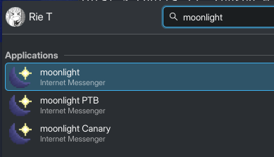

# moonlight Launcher

Quickly and conveniently launch moonlight, on Windows, Linux, and Flatpak!

Auto-updates moonlight on startup so you never have to think about it, and has support for local git installs of moonlight for developers too!

# Screenshots


|                  Windows                   |                 Linux                  |
| :----------------------------------------: | :------------------------------------: |
|  |  |

# Windows

Download and run [the latest installer](https://github.com/MeguminSama/moonlight-launcher/releases/latest/download/moonlight-installer.exe) and pick the branches of Discord you want.

# Linux

The Linux build also supports flatpak, and will use it if it cannot find another instance of Discord on your filesystem.

## Stable

```
sh -c "$(curl -fsSL https://github.com/MeguminSama/moonlight-launcher/releases/latest/download/install.sh)"
```

moonlight launcher is also available on the AUR

```
paru -S moonlight-stable
```

## PTB

```
sh -c "$(curl -fsSL https://github.com/MeguminSama/moonlight-launcher/releases/latest/download/install.sh)" -- ptb
```

## Canary

```
sh -c "$(curl -fsSL https://github.com/MeguminSama/moonlight-launcher/releases/latest/download/install.sh)" -- canary
```

## Uninstalling

```
sh -c "$(curl -fsSL https://github.com/MeguminSama/moonlight-launcher/releases/latest/download/install.sh)" -- --uninstall <branch>
```

# MacOS

Working on it...

# Commandline Arguments

## Using a local (git) instance of a mod?

You can pass the `--local` flag with a path to the entrypoint. For example:

```
moonlight-stable --local $HOME/workspace/moonlight/injector.js
```

## Passing arguments through to discord?

Any arguments passed after `--` are passed through to Discord. For example:

```
moonlight-stable -- --start-minimized --enable-blink-features=MiddleClickAutoscroll
```
